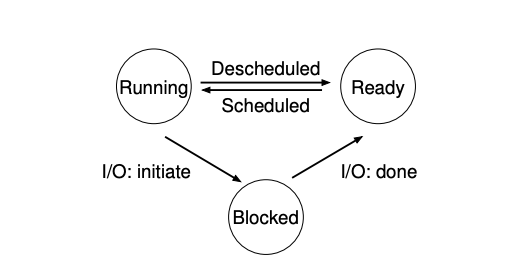
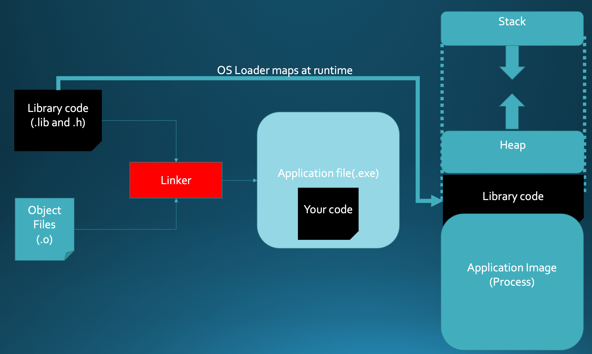
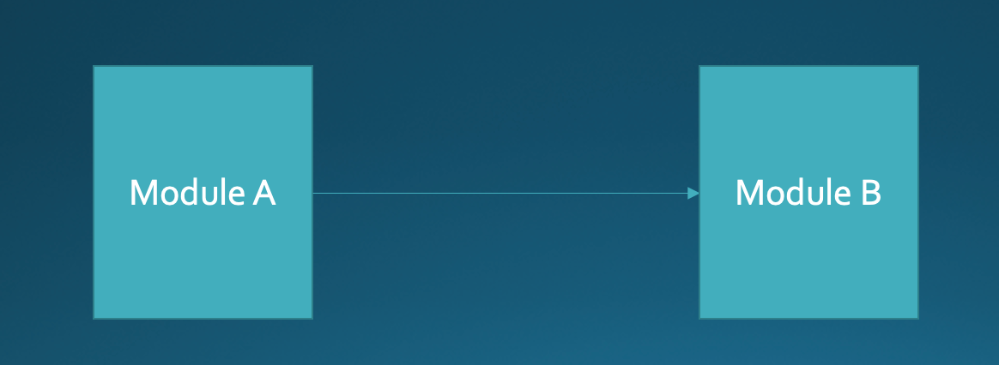

# The Process

The process is one of the most fundamental abstractions that the OS
provides to users. A process is a running program.

- Address space
- Registers
  - programming counter (PC)
  - OR instruction pointer (IP)
- Stack pointer

## Process API

- Create
- Destroy
- Wait
- Miscellaneous Control
- Status

## Loading A process

## Process States

## Data Structures

A process is just a struct!

[Linux Process](https://docs.huihoo.com/doxygen/linux/kernel/3.7/structtask__struct.html)

## Libraries

- A dynamic-link library (DLL or .so) is a module that contains
    functions and data
- Applications (processes) can use the functions and data in the code
- This is the most common way code is distributed.
- Up until this point you have only ever distributed code in an
    executable (exe)

## Dynamic Libraries

- During compile time the linker stubs out calls to the .dll or .so
- The actual implementation is not added into the image that is saved to disk
- The library is mapped into your applications address space at run time

## Load-time dynamic linking

Your code makes explicit calls to exported DLL functions as if they were
local functions.

## Run-time dynamic linking

Functions are loaded with system calls such as LoadLibrary or
LoadLibraryEx (WIN32)

## Advantages of Dynamic Linking

- Multiple processes that load the same DLL at the same base address will share a single copy of the DLL
- When you update a DLL the applications that use them do not need to be recompiled
- Programs written in different programming languages can call the same DLL functions

## Disadvantages of Dynamic Linking

## Loading

## Static Libraries

- Similar to dynamic libraries
- Code is added into your application at compile time instead of
    runtime. The library becomes part of the image saved on disk
- Your application will not have any dependencies that need to be
    resolved at runtime

## Advantages of Static Linking

- All your code is contained in one file (your exe or lib)
- Easier to ship to a customer
- Could be more secure because you know exactly what you are loading
- Eliminates any issues with missing libraries on the host system

## Disadvantages of Static Linking

- Your program is bigger and takes longer to load into memory
- If there is a security flaw in your linked code you will still be using the old version
- If library code get faster or adds support for new hardware you are stuck on the old version

## Dependency Types

## Implicit Dependency

Module A is implicitly linked with Module B at compile/link time

## Explicit Dependency

Module A is not linked with Module B at compile/link time. At runtime,
Module A dynamically loads Module B via a LoadLibrary type function

## Forward Dependency

Module A is linked with a LIB file for Module B at compile/link time,
and Module A’s source code actually calls one or more functions in
Module B. One of the functions called in Module B is actually a
forwarded function call to Module C

