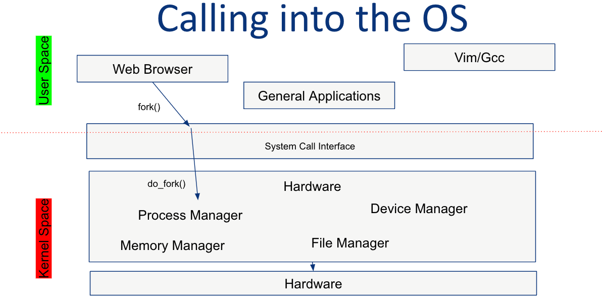

# Limited Direct Execution

The OS must virtualize the CPU in an efficient manner while retaining
control over the system. To do so, both hardware and operating-system
support will be required. The OS will often use a judicious bit of
hardware support in order to accomplish its work effectively.

- The “direct execution” part of the idea is simple: just run the
    program directly on the CPU.
- The Limited part of the idea means the process only has a subset of
    the CPU instructions available to use when running

## Details

Direct execution means the program will run fast (bare metal) compare
this to Java or C# which run in a Virtual Machine.

## Problem \#1 Restricted Operations

- User Mode - code that runs in user mode is restricted in what it can do.
- Kernel Mode - In this mode, code that runs can do what it likes,
    including privileged operations such as issuing I/O requests and
    executing all types of restricted instructions.

Special instructions to trap into the kernel and return-from-trap back
to user-mode programs are also provided, as well as instructions that
allow the OS to tell the hardware where the trap table resides in
memory.

[Intel Trap Instruction](https://www.intel.com/content/www/us/en/docs/programmable/683620/current/trap-instruction.html)

## Trap Table

- The kernel sets up a trap table at boot time
- To specify the exact system call, a system-call number is usually assigned to each system call.
- What horrible things could you do to a system if you could install your own trap table? Could you take over the machine?

## System Call

## Standard Library

## Problem \#2 Switching Between Processes

- If a process is running on the CPU, this by definition means the OS is not running
- How can the operating system regain control of the CPU so that it can switch between processes?
- A Cooperative Approach - the OS trusts the processes of the system to behave reasonably
- The OS Takes Control - Needs hardware support
- Timer interrupt!

## Saving and Restoring Context

- The OS scheduler decides what to run next
- A Context switch is what happens when on process is moved off the processor and another is moved on

## Concurrency?

- Now we have to worry about what happens when we get interrupted right in the middle of doing something important
- Not to worry we will go over that in a future chapter!
