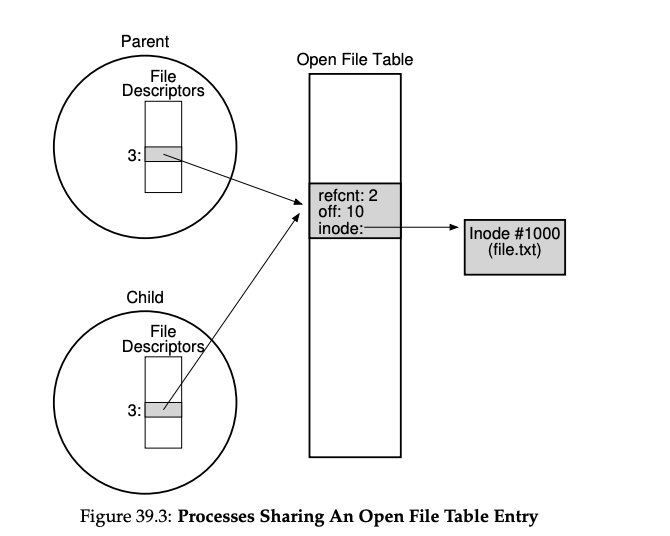

# Files And Directories

- File - A file is simply a linear array of bytes, each of which you
    can read or write
- Directory - A directory, like a file, also has a low-level name
    (i.e., an inode number), but its contents are quite specific: it
    contains a list of (user-readable name, low-level name) pairs

## Example

## Interface

Let’s now discuss the file system interface in more detail. We’ll start
with the basics of creating, accessing, and deleting files

## Creating Files

    int fd = open("foo", O_CREAT|O_WRONLY|O_TRUNC,
        S_IRUSR|S_IWUSR);

One important aspect of open() is what it returns: a file descriptor. A
file descriptor is just an integer, private per process, and is used in
UNIX systems to access files; thus, once a file is opened, you use the
file descriptor to read or write the file, assuming you have permission
to do so.

## Reading And Writing Files

    $ strace cat foo
    ...
    open("foo", O_RDONLY|O_LARGEFILE) = 3
    read(3, "hello\n", 4096) = 6
    write(1, "hello\n", 6) = 6
    hello
    read(3, "", 4096) = 0
    close(3) = 0

## Process Sharing

## Buffering

Most times when a program calls write(), it is just telling the file
system: please write this data to persistent storage, at some point in
the future.

When a process calls fsync() for a particular file descriptor, the file
system responds by forcing all dirty (i.e., not yet written) data to
disk, for the file referred to by the specified file descriptor.

## Getting Information About Files

Beyond file access, we expect the file system to keep a fair amount of
information about each file it is storing. We generally call such data
about files metadata. To see the metadata for a certain file, we can use
the stat() or fstat() system calls.

    struct stat {
        dev_t st_dev; // ID of device containing file
        ino_t st_ino; // inode number
        mode_t st_mode; // protection
        nlink_t st_nlink; // number of hard links
        uid_t st_uid; // user ID of owner
        gid_t st_gid; // group ID of owner
        dev_t st_rdev; // device ID (if special file)
        off_t st_size; // total size, in bytes
        blksize_t st_blksize; // blocksize for filesystem I/O
        blkcnt_t st_blocks; // number of blocks allocated
        time_t st_atime; // time of last access
        time_t st_mtime; // time of last modification
        time_t st_ctime; // time of last status change
    };

## Removing Files

    $ strace rm foo
    ...
    unlink("foo") = 0
    ...

Removing a file doesn’t wipe it from the disk! The file is still
there just not directly accessible! Deleted files can still be
recovered (for a while).

## Symbolic Links

- There is one other type of link that is really useful, and it is
    called a symbolic link or sometimes a soft link.
- This allows you to create a link or pointer to a file

# Permission Bits

    $ ls -l foo.txt
    -rw-r--r-- 1 remzi wheel 0 Aug 24 16:29 foo.txt

- The first character here just shows the type of the file: - for a
    regular file
- The permissions consist of three groupings: what the owner of the
    file can do to it, what someone in a group can do to the file, and
    finally, what anyone (sometimes referred to as other) can do.

## Mounting file systems

Linux has a single root for its directory while windows has a multi-root
approach.

    mount -t ext3 /dev/sda1 /home/users
