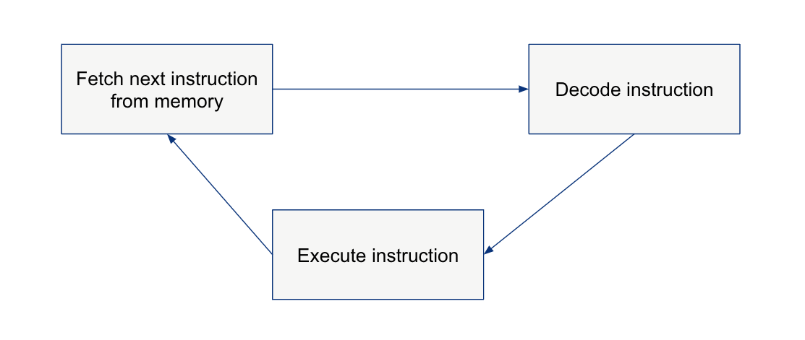

# Operating Systems Introduction

## The Von Neumann Model

## The OS

virtualization - The OS takes a physical resource (such as the
processor, or memory, or a disk) and transforms it into a more general,
powerful, and easy-to-use virtual form of itself

## Virtualization

- Virtualizing The CPU
- Virtualizing Memory

## Concurrency

- Multiple processes
- Multiple threads within a process

## Persistence

- Saving data to disk
- The filesystem
  - Files
  - Directories

## Design Goals

- Provide a set of abstractions in order to make the system convenient and easy to use.
- Provide high performance
- Minimize overheads
- Protection and security
- Energy efficiency

## Some History

- Early Operating Systems: Just Libraries
- Beyond Libraries: Protection
- The Era of Multiprogramming

## The Modern Era

Hardware support and protection and well defined boundaries.

## Kernel Space

- All machine instructions are available.
- All memory addresses are available.

## User Space

- A subset of the instructions are available. Typically I/O
    instructions and instructions that change the mode bit are not
    available. Using those instructions causes the process to fault and
    stop.
- A subset of the memory addresses are available.
