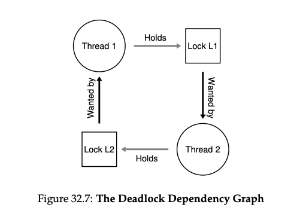

# Concurrency Bugs

## Non-Deadlock Bugs

Non-deadlock bugs make up a majority of concurrency bugs, according to
Lu’s study. But what types of bugs are these? How do they arise? How can
we fix them?

## Atomicity-Violation Bugs

AKA: Memory Stops

    Thread 1::
    if (thd->proc_info) {
        fputs(thd->proc_info, ...);
    }

    Thread 2::
    thd->proc_info = NULL;

- How to fix this?

## Order-Violation Bugs

AKA: Race Conditions

    Thread 1::
    void init() {
        mThread = PR_CreateThread(mMain, ...);
    }

    Thread 2::
    void mMain(...) {
        mState = mThread->State;
    }

## Deadlock

    Thread 1: Thread 2:
    pthread_mutex_lock(L1); pthread_mutex_lock(L2);
    pthread_mutex_lock(L2); pthread_mutex_lock(L1);

## Conditions for Deadlock

- Mutual exclusion: Threads claim exclusive control of resources that
    they require (e.g., a thread grabs a lock).
- Hold-and-wait: Threads hold resources allocated to them (e.g., locks
    that they have already acquired) while waiting for additional
    resources (e.g., locks that they wish to acquire).
- No preemption: Resources (e.g., locks) cannot be forcibly removed
    from threads that are holding them.
- Circular wait: There exists a circular chain of threads such that
    each thread holds one or more resources (e.g., locks) that are being
    requested by the next thread in the chain.

## Prevention

- Circular Wait - total ordering or partial ordering
- Hold-and-wait - global lock
- try-lock
- lock free data structures (HARD!)
