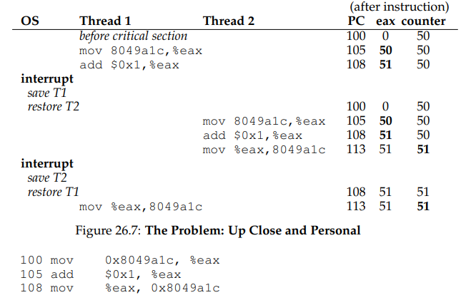

# Threads

## What is a Thread

Instead of our classic view of a single point of execution within a
program (i.e., a single PC where instructions are being fetched from and
executed), a multi-threaded program has more than one point of execution
(i.e., multiple PCs, each of which is being fetched and executed from).

## More details

Perhaps another way to think of this is that each thread is very much
like a separate process, except for one difference: they share the same
address space and thus can access the same data.

## Important Terms

- A **critical section** is a piece of code that accesses a shared
    resource, usually a variable or data structure.
- A **race condition** arises if multiple threads of execution enter
    the critical section at roughly the same time
- An **indeterminate program** consists of one or more race
    conditions; the output of the program varies from run to run,
    depending on which threads ran when.
- **mutual exclusion** guarantees that only a single thread ever
    enters a critical section, thus avoiding races, and resulting in
    deterministic program outputs.

## Code Example

We assume that the process never terminates in the pre-protocol,
critical section, and post-protocol areas. A process can terminate
abnormally in the remainder section. If a process dies in the remainder
section, it should not affect other processes.

    for(;;){
            /*pre-protocol*/
            /*critical section*/
            /*post-protocol*/
            /*remainder*/
    }

## Context Switch

- Threads will context switch just like processes
- Instead of a Process control block (PCB) we have a thread control block (TCB)
- In a TCB the address space remains the same!

## Memory Layout

## Why Use Threads?

- First reason: Parallelism 🚙🚙🚙
- The second reason: to avoid blocking program progress due to slow I/O
  - Opening and reading 10 files all at once!

## Why not just processes?

- Of course, in either of the cases mentioned above, you could use multiple processes instead of threads.
- Threads share an address space and thus make it easy to share data,
    and hence are a natural choice when constructing these types of
    programs
- Processes are a more sound choice for logically separate tasks where
    little sharing of data structures in memory is needed.

## Example

    1 #include <stdio.h>
    2 #include <assert.h>
    3 #include <pthread.h>
    4 #include "common.h"
    5 #include "common_threads.h"
    6
    7 void *mythread(void *arg) {
    8       printf("%s\n", (char *) arg);
    9       return NULL;
    10 }
    11
    12 int
    13 main(int argc, char *argv[]) {
    14      pthread_t p1, p2;
    15      int rc;
    16      printf("main: begin\n");
    17      Pthread_create(&p1, NULL, mythread, "A");
    18      Pthread_create(&p2, NULL, mythread, "B");
    19      // join waits for the threads to finish
    20      Pthread_join(p1, NULL);
    21      Pthread_join(p2, NULL);
    22      printf("main: end\n");
    23      return 0;
    24 }

## Instruction Interleaving

We don’t control the scheduler! ⚠️

    counter = counter + 1;

    // Assembly
    mov 0x8049a1c, %eax
    add $0x1, %eax
    mov %eax, 0x8049a1c

## Atomicity

One way to solve this problem would be to have more powerful
instructions that, in a single step, did exactly whatever we needed done
and thus removed the possibility of an untimely interrupt.

    //pretend atomic add instruction!
    memory-add 0x8049a1c, $0x1

    //Performs all three instructions without interruption!
    mov 0x8049a1c, %eax
    add $0x1, %eax
    mov %eax, 0x8049a1c

## Synchronization Primitives

- Need to build primitives that allow us to do atomic operations
  - Locks 🔒
- Need to build primitives that allow us to wait for action to be complete
  - Condition Variables
- Need to build more powerful primitives
  - Semaphores

## Why in OS Class?

Why are we studying this in OS class? “History” is the one-word answer;
the OS was the first concurrent program, and many techniques were
created for use within the OS. Later, with multi-threaded processes,
application programmers also had to consider such things.
