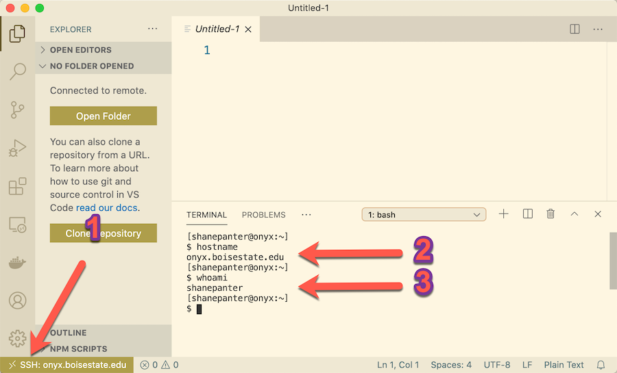
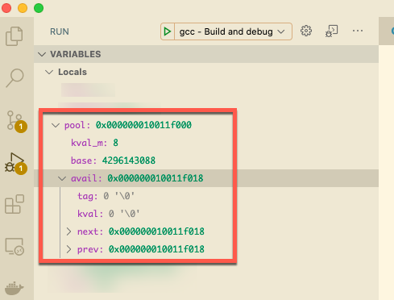

# VSCode Tips and Tricks

This document will walk you through doing development using VSCode and
introduce you to some cool tips and tricks. You can install VSCode on
your personal machine, or you can use VSCode in the cloud with [GitHub
Codespaces](https://github.com/features/codespaces).

## Install VSCode

You can install VSCode and all the required tools on your personal
(local) machine. The advantages of using a local install is it is 100%
free and you don’t need an internet connection to do your work. The
disadvantage is it can sometimes be difficult and time consuming to
install and configure all the tools correctly especially if you are
using the Windows operating system.

1. [Install Git](https://git-scm.com/downloads)
2. [Install Visual Studio Code (Java)](https://code.visualstudio.com/learntocode/)
3. Read through the [User interface tutorial](https://code.visualstudio.com/docs/getstarted/userinterface)
4. [Read Terminal Basics](https://code.visualstudio.com/docs/terminal/basics)
5. Complete all the steps in the first time configuration section of this document.

## First time configuration

Before we start using VSCode we need to set a few basic configurations.
Each section is clearly labeled with what operating system it applies
to. You need to follow these steps on both local and remote setups.

### Configure defaults

This section must be completed on ALL operating systems.

The last step before beginning to write code is to configure the user
tags that will be stored as metadata on each commit for your development
environment. To do this, open VSCode then click View in the top menu and
select Terminal. Enter the following commands in the terminal, using
your name and email address

```bash
git config --global user.name "Your Name"
git config --global user.email "you@example.com"
```

When you are first learning to use git using a rebase workflow can help
to reduce the number of conflicts that you have to deal with. Thus, we
will set it as the default method when pulling down code.

```bash
git config --global pull.rebase true
git config --global fetch.prune true
git config --global diff.colorMoved zebra
```

Additional reading:

- [Merging vs. Rebasing](https://www.atlassian.com/git/tutorials/merging-vs-rebasing)
- [Git configurations](https://spin.atomicobject.com/2020/05/05/git-configurations-default/)

### Configure the default terminal (Windows Only)

This section only applies to Windows users who are developing locally.
If "Git Bash" is not listed as an option you need to [install
Git](https://git-scm.com/downloads) as detailed in the first section of
this document.

VSCode defaults to powershell on Windows. While powershell is a great
terminal all the scripts in my classes require Git Bash. So it is best
to set the default terminal to Git Bash so everything works correctly

1. Open Visual Studio Code
2. Press CTRL + SHIFT + P to open the Command Palette
3. Search for “Terminal: Select Default Profile”
4. Select "Git Bash"


## Developing Remotely

This section is optional and is provided for students who wish to
develop remotely. You are not required to develop remotely, all the
homework assignments can be done on the CS lab machines in person.

This section will walk you through using VSCode to develop remotely.
This is incredibly convenient as it allows you to connect directly to a
server to run and test your code. For advanced users you can read
through the [official
documentation](https://code.visualstudio.com/docs/remote/ssh) for more
details on how everything works.

### Connecting to a Server

- First you need to install the [Remote development extension pack](https://marketplace.visualstudio.com/items?itemName=ms-vscode-remote.vscode-remote-extensionpack)
- Open the [command pallet](https://code.visualstudio.com/docs/getstarted/userinterface#_command-palette)
- Select *Remote-SSH: Connect to Host…​* from the Command Palette (F1) and connect to *username@servername.com*
  - VSCode will save your information so when you connect again you will just select the server from the list!
- Select connect to started developing
  - **NOTE:** The first time you connect it may take some time for VSCode to
    install all the tools so be patient and don’t close or stop the process or
    it could cause your install to fail!


### Verify your connection

Once you are connected you can verify your status as shown below:

1. You should see SSH: onyx.boisestate.edu
2. When you run the command *hostname* in the integrated terminal you should see onyx.boisestate.edu
3. When you run the command *whoami* in the integrated terminal you should see your Boise State username.



### Installing remote extensions

When you are working remote VSCode does not automatically install any of
your extensions. To get all your remote extensions installed open the
[Extension
manager](https://code.visualstudio.com/docs/editor/extension-gallery)
and then select the local extensions that you wish to install on the
remote machine.


## Debugging Pointers

In the C programming language we can allocate a chunk of memory on the
heap and treat that chunk of memory as an array. If you are working on
debugging a problem and want to inspect the contents of the array using
the GUI debugger interface in VSCode you may have to tell the debugger
(with a cast) that a pointer is actually pointing to a dynamically
allocated array not a single variable. This example walks through how to
display a pointer as an array that is embedded within a struct.

More reading about C and GDB.

- [Reading C Declarations](http://unixwiz.net/techtips/reading-cdecl.html)
- [GDB Artificial Arrays](https://sourceware.org/gdb/current/onlinedocs/gdb/Arrays.html)
- [GDB to LLDB usage](http://lldb.llvm.org/use/map.html)
- [VSCode Data inspection](https://code.visualstudio.com/docs/editor/debugging#_data-inspection)

### Dynamic array of structs

Consider the struct declaration `buddy_pool` shown below. The `avail`
member is a pointer that we must dynamically allocate and want to
display in the debugger as an array. We can allocate the a `buddy_pool`
struct (in the stack or data segment) and then dynamically allocate the
`avail` array using `malloc`.

```c
struct avail
{
    int tag;
    int kval;
    struct avail *next;
    struct avail *prev;
}
struct buddy_pool
{
    size_t kval_m;
    uintptr_t base;
    struct avail *avail; /*pointer to the start of the avail array*/
};
struct buddy_pool pool;
pool.kval = 9;
pool.base = 0;
pool.avail = malloc(sizeof(struct avail) * 9);
```

If we run the debugger we will see the variable `pool` with the element
`avail` is displayed as a single variable not an array of 9 structs as
we expected.



The element `avail` is just a pointer to the memory address of element
and the debugger can’t determine the size of the array and thus will
display it as a single struct instead of an array as expected.

### Cast the array

Fortunately, all is not lost! Most debuggers allow you to set a watch on
a memory location and you can force the debugger to cast the memory to a
certain type. Both gdb and lldb have specific commands to display a
memory block as an array. However, using casting works regardless of
what debugger you are using.

If we add a new
[watch](https://code.visualstudio.com/docs/editor/debugging#_data-inspection)
on a variable and then force the debugger to display the memory block as
an array instead of a single variable we can easily inspect the data and
track down any issues you are experiencing.

`(struct avail(*) [9])pool->avail`


### Dynamic Array

For a plain old dynamic array you can add a watch expression that is set
to to the desired type.

`*(int(*)[10])A`
