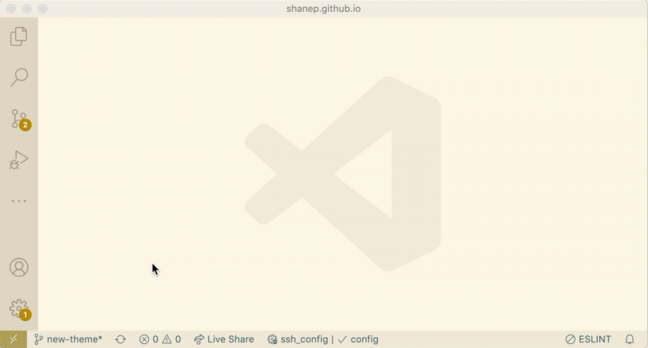
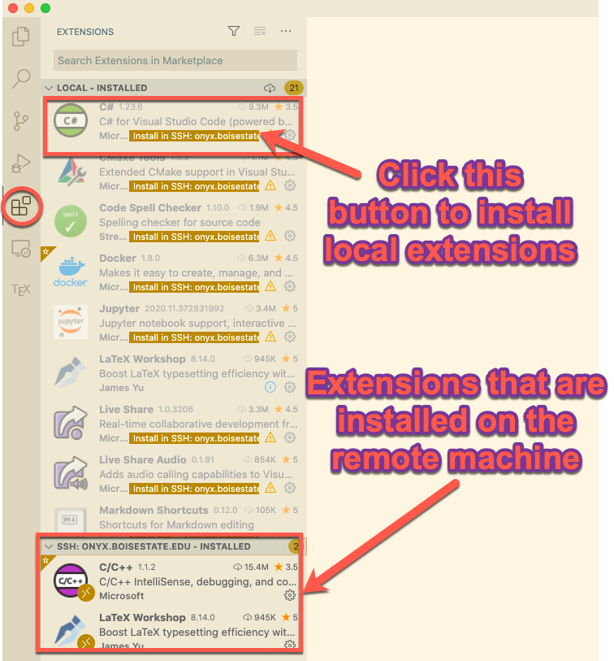

# VSCode Tips and Tricks

This document will walk you through doing development using VSCode and
introduce you to some cool tips and tricks. You can install VSCode on
your personal machine, or you can use VSCode in the cloud with [GitHub
Codespaces](https://github.com/features/codespaces).

## Install VSCode

You can install VSCode and all the required tools on your personal
(local) machine. The advantages of using a local install is it is 100%
free and you don’t need an internet connection to do your work. The
disadvantage is it can sometimes be difficult and time consuming to
install and configure all the tools correctly especially if you are
using the Windows operating system.

1. [Install Git](https://git-scm.com/downloads)
2. [Install Visual Studio Code (Java)](https://code.visualstudio.com/learntocode/)
3. Read through the [User interface tutorial](https://code.visualstudio.com/docs/getstarted/userinterface)
4. [Read Terminal Basics](https://code.visualstudio.com/docs/terminal/basics)
5. Complete all the steps in the first time configuration section of this document.

## First time configuration

Before we start using VSCode we need to set a few basic configurations.
Each section is clearly labeled with what operating system it applies
to. You need to follow these steps on both local and remote setups.

### Configure defaults

This section must be completed on ALL operating systems.

The last step before beginning to write code is to configure the user
tags that will be stored as metadata on each commit for your development
environment. To do this, open VSCode then click View in the top menu and
select Terminal. Enter the following commands in the terminal, using
your name and email address

```bash
git config --global user.name "Your Name"
git config --global user.email "you@example.com"
```

When you are first learning to use git using a rebase workflow can help
to reduce the number of conflicts that you have to deal with. Thus, we
will set it as the default method when pulling down code.

```bash
git config --global pull.rebase true
git config --global fetch.prune true
git config --global diff.colorMoved zebra
```

Additional reading:

- [Merging vs. Rebasing](https://www.atlassian.com/git/tutorials/merging-vs-rebasing)
- [Git configurations](https://spin.atomicobject.com/2020/05/05/git-configurations-default/)

### Configure the default terminal (Windows Only)

This section only applies to Windows users who are developing locally.
If "Git Bash" is not listed as an option you need to [install
Git](https://git-scm.com/downloads) as detailed in the first section of
this document.

VSCode defaults to powershell on Windows. While powershell is a great
terminal all the scripts in my classes require Git Bash. So it is best
to set the default terminal to Git Bash so everything works correctly

1. Open Visual Studio Code
2. Press CTRL + SHIFT + P to open the Command Palette
3. Search for “Terminal: Select Default Profile”
4. Select "Git Bash"


## Developing Remotely

This section is optional and is provided for students who wish to
develop remotely. You are not required to develop remotely, all the
homework assignments can be done on the CS lab machines in person.

This section will walk you through using VSCode to develop remotely.
This is incredibly convenient as it allows you to connect directly to a
server to run and test your code. For advanced users you can read
through the [official
documentation](https://code.visualstudio.com/docs/remote/ssh) for more
details on how everything works.

### Connecting to a Server

- First you need to install the [Remote development extension pack](https://marketplace.visualstudio.com/items?itemName=ms-vscode-remote.vscode-remote-extensionpack)
- Open the [command pallet](https://code.visualstudio.com/docs/getstarted/userinterface#_command-palette)
- Select *Remote-SSH: Connect to Host…​* from the Command Palette (F1) and connect to *username@servername.com*
  - VSCode will save your information so when you connect again you will just select the server from the list!
- Select connect to started developing
  - **NOTE:** The first time you connect it may take some time for VSCode to
    install all the tools so be patient and don’t close or stop the process or
    it could cause your install to fail!



### Verify your connection

Once you are connected you can verify your status as shown below:

1. You should see SSH: onyx.boisestate.edu
2. When you run the command *hostname* in the integrated terminal you should see onyx.boisestate.edu
3. When you run the command *whoami* in the integrated terminal you should see your Boise State username.


### Installing remote extensions

When you are working remote VSCode does not automatically install any of
your extensions. To get all your remote extensions installed open the
[Extension
manager](https://code.visualstudio.com/docs/editor/extension-gallery)
and then select the local extensions that you wish to install on the
remote machine.


